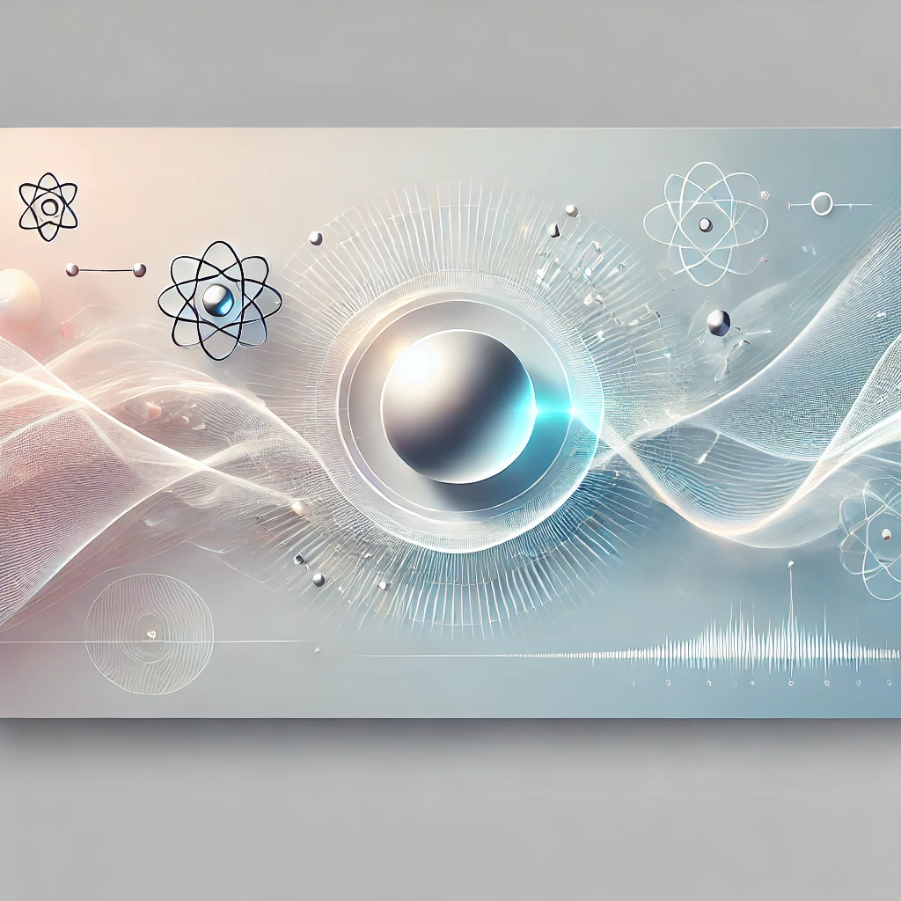

  

# quantum_notebook_lab
A growing collection of interactive Qiskit-based notebooks exploring quantum computing concepts and experiments — from basic qubits to advanced simulations.

# 🧪 Quantum Notebook Lab

Welcome to **Quantum Notebook Lab** — an open, interactive collection of quantum computing experiments powered by [Qiskit](https://qiskit.org/).  
This repo serves as a lab notebook of sorts: part learning, part tinkering, part simulation — all quantum.

---

## 📘 What’s Inside

- Beginner-friendly notebooks
- Real quantum concepts, visualized with Python
- Based on real and simulated quantum devices
- Self-explanatory code + markdown to help understand each step

...

